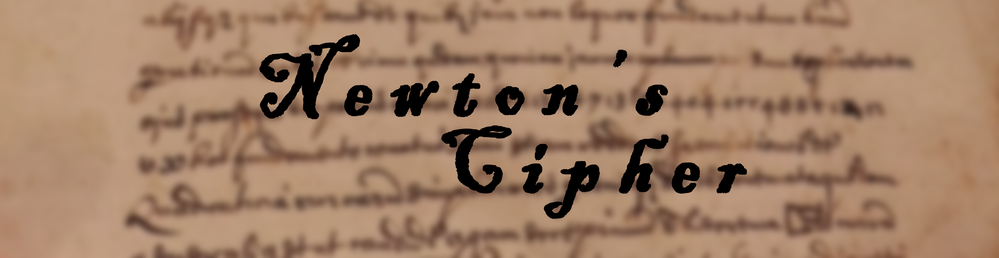

# Newtons-Cipher

## Description

On October 24th 1676, Newton wrote a letter to Leibniz in Latin explaining fluxion, but the letter was actually concealed in code because he was suspicious of Leibniz. 
The program will prompt and take in a string, transverses and encipher it with Newton's cipher. For example: `I am Batman` will translate to `3abimmn`.

### How does the cipher work?

* The string is re-arranged into alphabetical order
* Counts the frequency of a letter and represent it with a number, if the frequency is less than 3 then it is printed twice 
* (For e.g. `I am Batman`, there are 3 `a`'s so `3a`, 2 `m`'s so `mm`.

### Task lists

- [x] Optimize :tada:
- [ ] https://github.com/wluxie/Newtons-Cipher/issues/1
- [ ] Decipher the string after encrypting it
